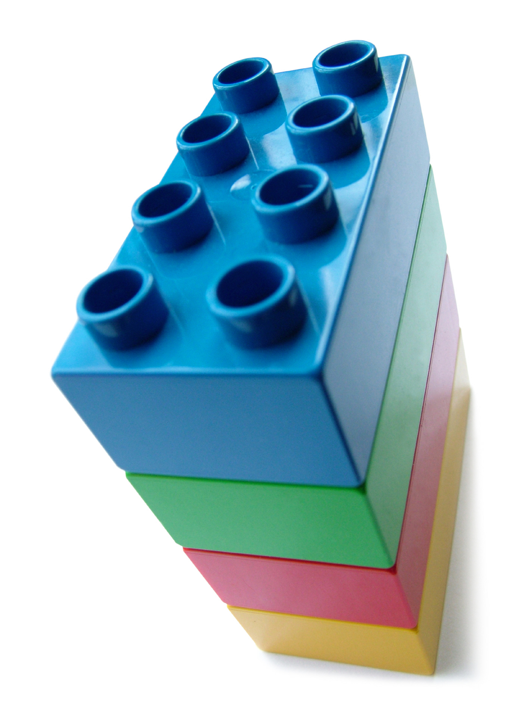

# (APPENDIX) Appendices {-}

# Appendix A: R as a Statistical Programming Language {#RSPL}

## Overview

```{r}
library(knitr)
```


* Why use Statistical Programming Languages?

Computers and Programs

* Fixed program computer
    + programs are "hard-wired" into computer
    + calculator, stopwatch
    
* Stored program computer
    + machine stores and executes instructions
    + most modern computers, your phone, etc.


Statistical Programs versus Statistical Programming Language

* Statistical Programs
    + fixed menus
    + limited procedures (at least in the menus)
    + leads to compartmentalizing models (e.g. ANOVA, regression, GLM)
    
* Statistical Programming Languages (SPLs)
    + Turing complete: if you can create an algorithm you can program it
    + Very flexible
    + Integration of models: One model to rule them all!


Everythin

## Elements of Statistical Programming


### Basic Elements of a Good SPL

1. a rich set of **primitive expressions**
2. mechanisms for **combining expressions** into more complex expressions
3. means of **abstraction**, which allow for naming and manipulating compound objects


```{r, echo=FALSE, out.width='40%'}
include_graphics(path = "figures/blocks.jpg")
```


```{r, echo=FALSE, out.width='20%'}

```


```{r, echo=FALSE, out.width='40%'}
include_graphics("figures/sanfran.jpg")
```


## Expressions


## Primitive Expressions

```{r, echo=FALSE, out.width='30%'}
include_graphics(path = "figures/blocks.jpg")
```

* Everything in R is an object
* Primitive objects are the simplest elements of a programming language, and include:
    + *primitive data* 
    + *primitive functions*
    
* They can be thought of as the basic building blocks for everything else in the language.

* An **expression** is an input that the programming language can evaluate, and consists of function and data objects.

## Primitive Data Types:

Data objects are the primary means of storing information in R.
R has a few basic *data types*:

* **Numeric** - 
    + `numeric`
        - `int` - integers (`1,2`)
        - `num` - real number (`1.2, -3.1, 200.0`)

* **character** or **string** - 
    + `character` 
        - `"Hello world!"`, `"Ten"`, `'Cat'`
        - `"This is a sentence, which is a string"`
        - `"10"` ( in single or double quotes, as long as they match)

* **Boolean** or **Logical** 

    + `logical`
        - `TRUE` or `FALSE` (use operators such as *or*, *and* and *not*).
        - They will evaluate to numbers where `FALSE` evaluates to zero, and `TRUE` evaluates to one.
        - For example. if you enter `TRUE + 1` you will get `2` in return.

```{r}
mode(TRUE)
TRUE + 1
```

## Primitive Functions

R uses functions to do all computations.

### Operators

* Arithmetic Operators 
    + +, -, *, /, ^

* Comparison (also called Boolean, Logical or Predicate) Operators
    + `<, >, ==, <=, >=, !=` 
    + less than, greater than, equal to, less than or equal to, greater than or equal to, not equal to
    + return `TRUE` or `FALSE`
* Logical Operator
    + `&`, `|` ,`!`
    + also return `TRUE` or `FALSE`
* Other functions
    + `mode()`
    + `length()`
    + `sum()`
    + `sqrt()`
    + `log()`
    + `exp()`
    
* Assignment operators (assignment will be discussed below)
    * `<-` **preferred assignment operator - always use this one**
    * `=`  this will also work, but can be confusing (note different from `==`, the comparison operator)
    * `->` is also an assignment operator, but we will not use it.
    
## Programming Languages are Not Forgiving

### Syntactically valid expressions

Expressions must be syntactically valid. 

* syntax (form)
  + English: "cat dog boy" - not syntactically valid
  + English: "cat hugs boy" - syntactically valid
  
* programming language: 
    + "hi" 5 - not syntactically valid
    + 3.2*5 - syntactically valid

### Semantically valid expressions

* semantics - (meaning)
    + English: "I are hungry" - syntactically valid but semantic error
    + programming language: 
        - 3 + "hi" - semantic error (you can't use addition on  character strings)
        
* Chomsky:
      "colorless green ideas sleep furiously"

This statement is syntactically valid, but does not make sense, so makes a semantic error.

## Assignment

We will often want to save data in a variable. We can do that with **assignment**, which utilizes an assignment operator.

```{r}
x <- 2
```

```{r}
x
```

```{r}
pet <- "dog"
```

```{r}
pet
```


## Combining Expressions

```{r, echo=FALSE, out.width='30%'}

```


## Complex Data Types

* Scalars, Vectors, Matrices, and Arrays
* Lists
* Dataframes


## Grouping Homogeneous Data Types

* combining scalars
```
c()
```
* combining expressions
```
{}
```
* combining vectors
```
cbind()
rbind()
```


## Complex Functions

* Vectorization
* Nested Functions
* Loops and Conditional execution


class: inverse, center, middle

## Abstraction

## Abstraction

* Assignment
* 


## Data Abstraction


## Functional Abstraction


## Anatomy of a Function

```
name <- function(arg_1, arg_2, ...) expression
```


## Teaching With A Statistical Programming Language

### An Example


## myMean


## Basic Elements of a Good SPL

A rich set of **primitive expressions**


```{r, echo=FALSE, out.width='30%'}
include_graphics("figures/blocks.jpg")
```


Mechanisms for **combining expressions** into more complex expressions

```{r, echo=FALSE, out.width='10%'}

```

Means of **abstraction**, which allow for naming and manipulating compound objects

```{r, echo=FALSE, out.width='40%'}
include_graphics("figures/sanfran.jpg")
```

